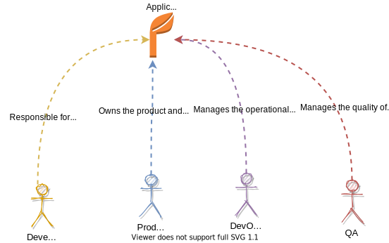

# Blue green deployments for EKS

This article explains an approach to enable blue green deployment for applications deployed in EKS. We will use existing AWS services like CodeBuild and CodePipeline to facilitate blue green deployments for kubernetes applications

## Overview

Blue/green deployments provide near-zero downtime release and rollback capabilities. The fundamental idea behind blue/green deployment is to shift traffic between two identical environments that are running different versions of your application. The blue environment represents the current application version serving production traffic. In parallel, the green environment is staged running a newer version of your application. After the green environment is ready and tested, production traffic is redirected from blue to green. If any problems are identified, you can roll back by reverting traffic to the blue environment.

## Benefits

Blue/green deployment involves two production environments:

* Blue is the active environment.
* Green is for the release of a new version.

Here are some of the advantages of a blue/green deployment:

* You can perform testing on the green environment without disrupting the blue environment.
* Switching to the green environment involves no downtime. It only requires the redirecting of user traffic.
* Rolling back from the green environment to the blue environment in the event of a problem is easier because you can redirect traffic to the blue environment without having to rebuild it.
* You can incorporate the principle of infrastructure immutability by provisioning fresh instances when you need to make changes. In this way, you avoid configuration drift.

## Scale Blue Green deployments

Even though its easier to enable blue green deployment based on what we learnt so far but it can get a bit overwarming and nonscalable when implementing them as a standard for companies that deploys thousands of applications everyday across different availability zones. So lets see how we can implement an approach that will allow companies to scale  blue green deployment model using a shared responsibility model with some automation and manual checkpoints.

### Shared responsibility model

When it comes to development and deployment of an applications its a team effort. Here are the different persona's involved with this, falling into a shared responsibility model:



Here are some of the responsibilities that each persona shares:

**Developer**:

* Responsible for new features and bug fixes of the application
* Responsible for defining how the application gets packaged (via Dockerfile)
* Respossible for defining the infrastructure of the application (via k8s manifest files)

**Product owner**:

* Responsible for defining the current release and future roadmap of the product
* Responsible for products go-to market plan

**DevOps Engineer**:

* Responsible for managing the infrastructure of the product
* Responsible for application's change management process (when the product is made available for deployment)

### Build and release pipeline

We will create a build and release pipeline using the shared responsibility model in which each persona is resposible in managing certain aspects of the pipeline.


Here is how each stage will fit in with different personas:

In this scenarios *`DevOps Engineer`* is responsible for building this build and release pipeline (using codepipeline)

> Note: The sample application uses ALB ingress. `Green_ingress` is always the production endpoint.

1. **Stage I** - *`Developer`* is reponsible for this stage and takes care of the following:

* Writes the application code
* Creates the docker file (defining how application gets packaged)
* Creates the k8s manifest files (defining the infrastructure). Makes sure all the `name` and `references` in the manifest file is suffixed with `${DEPLOYMENT}`. Saved into `k8s/` directory in the root directory
* Checks-in the code in AWS CodeCommit.
* The code pipeline is automatically triggered once the changes are pushed into the `master` branch.

2. **Stage II** - CodeBuild will take care of building the code, docker image and pushing it to ECR
3. **Stage III** - CodeBuild will subsitute the value of environment variable `${DEPLOYMENT}` to deploy blue and/or green versions of the application based on following criterias:
    1. Check whether a blue version of service exists? - If it doesn't exist (first time deployment) codebuild will deploy both blue and green version of the application/deployment, services and ingress
    2. If blue version of the service exists then perform `kubectl set image` on the deployment pointed by `Blue_ingress` (nonprod). Lets consider the scenario in the above image where `Green_ingress` is pointing to `Green_service`, in this case the latest version of the application will be rolled out to `Blue_deployment` pointed by `Blue_service` this way we dont touch the production version of the application.
    > Scripts inside `postBuild` phase of CodeBuild uses `envsubst` command to dynamically update k8s names and references to deploy both blue and green version of the application.

    Once the deployment is complete:

    * *`QA`* get notified about the availability of new build (to be precise deployed as the blue version)
    * *`QA`* runs the tests using the `LoadbalancerURL` of the `Blue_ingress` component, validates the results, certifies the quality of the build and notifies *`Product Onwers`*.

4. **Stage IV** - *`Product Owner`* is responsible for this stage, where he manually approves the build (with comments) to get promoted, after getting a confirmation from *`QA`* team regarding the quality of the build.

5. **Stage V** - CodeBuild takes care of swapping the blue and green version of the application using `kubectl patch svc` command.

**Notes**:

Here are some preconditions for the pipeline to work:

- The pipeline excepts all the k8s manifest files available inside `k8s/` folder under root directory
- All kubernetes names and references inside manifest files needs to be suffixed with `${DEPLOYMENT}` token

Below diagram represents the sequence of the events between different persona's:


## Sample application

Here is the highlevel view of the architecture:


* "Weather-Service" - The sample microservice is a simple weather application that exposes a set of REST endpoints that customers can use to register and fetch weather prediction based on cities. The application is built using spring boot. Here is the list of rest endpoints exposed by the microservices:

| URL  | Method | Description | Sample request |
| ------------- | ------------- | ----| --- |
| /user | POST | Register a new user, service returns back an API key specific for the newly created user | ```json {"username":"user@gmail.com", "firstName":"first", "lastName":"last", "company":"company", "termsAndConditions": true }```|
| /user/details | GET | Get user details based on the username | /user/details?username=user@gmail.com |
| /user/weather | GET | Get weather details based on city (coordinates), start and end time (in YYYY-MM-DDTHH:MM:SSZ) format | /user/weather?apiKey=`apiKeyFromRegisterUser`&location=Tracy |
| /user | DELETE | Deletes user based on API key | /user?apiKey=`apiKeyFromRegisterUser` |

* Datamodel for 'user' table in RDS Aurora [Mysql]

| Column name  | Type | Description | Sample |
| ------------- | ------------- | ----| ---- |
| id | integer | Autogenerated (PK) | 0 |
| username | string | Username, can be email address | user@gmail.com |
| company | string | Name of the company | company |
| terms_and_conditions | boolean | Agreed to terms and conditions | true |
| api_key | string | UUID based generated API Key | 6768cfee-7857-4f52-936a-c4343f8d571c |
| fist_name | string | First name of the user | firstname |
| last_name | string | Last name of the user | lastname |

* The below tables highlights the configurations passes in to this application via environment variables

| Name | Description |
|------|-------------|
| RDS_HOSTNAME | RDS host name |
| RDS_PASSWORD | RDS password |
| RDS_USERNAME | RDS username |
| DEFAULT_CITY | Default city |
| DEFAULT_CITY_TEMP | Temperature that needs to reported for `DEFAULT_CITY` |
| LOW_NUMBER | Lowest temperature |
| HIGH_NUMBER | Highest temperature |

> Note: This is a mock weather service that returns a random temperature between `LOW_NUMBER` and `HIGH_NUMBER`. If the `location` sent in the request matches with `DEFAULT_CITY` then `DEFAULT_CITY_TEMP` is always returned back, instead of generating an random number between low and high values

## Infrastructure setup

### Pre-requistes

* AWS CDK should be installed in the local laptop. You can read more about it [here](https://docs.aws.amazon.com/cdk/latest/guide/getting_started.html)
* ```Yarn``` needs to be installed, you can check the installation status by running this command
* An AWS account with console and API access
* Docker desktop needs to be installed in the local laptop, you can read more about it [here](https://www.docker.com/products/docker-desktop)

```bash
yarn version
```

**Output**
1.22.10

If ```Yarn``` is not installed run the following command

```bash
npm install -g yarn
```

### Build

Check out the code from this repository using this command:

```bash
mkdir springboot-eks-migration && cd springboot-eks-migration
git clone git@ssh.gitlab.aws.dev:am3-app-modernization-gsp/eks/springboot-eks-migration.git .
```

> Note: Source code for 'Weather service' is available under [src\eks-weather-service](src/eks-weather-service) folder

### Deploy

Code for the sample application using this CDK construct is available in `src/integ.default.ts`. In order to deploy the application, first bootstrap a CDK environment (if you haven't done so already).

```bash
# Bootstrap CDK (ONLY ONCE, if you have already done this you can skip this part)
# Subsitute your AWS Account Id and AWS region in the command below
cdk bootstrap \
    --cloudformation-execution-policies arn:aws:iam::aws:policy/AdministratorAccess \
    aws://<AWS Account Id>/<AWS_REGION>
```

Run the following command to start the deployment

```bash
cdk deploy --require-approval never
```

Once the deployment is successful you will see the following output:

```bash
✅  blue-green-stack

Outputs:
blue-green-stack.BlueGreenDeployCodeCommitCloneUrlSsh768B3B34 = https://git-codecommit.us-east-1.amazonaws.com/v1/repos/code-base-microservice
blue-green-stack.BlueGreenDeployCodeCommitRepoArn421FE968 = arn:aws:codecommit:us-east-1:xxxxxx:code-base-microservice
blue-green-stack.BlueGreenDeployCodeCommitRepoName752219DF = code-base-microservice
blue-green-stack.BlueGreenDeployCodePipeline0AAEF314 = CfnPipeline
blue-green-stack.BlueGreenDeployECRRepo9647448D = xxxxxx.dkr.ecr.us-east-1.amazonaws.com/blue-green-stack-bluegreendeployecrrepo47a51719-kxpk5uyg0xpp
blue-green-stack.BlueGreenDeployRDSHostnameC2835BEA = blue-green-stack-bluegreendeploydb3ea0507a-1e3sa5ib6vv9b.cluster-cqsh75yzp1ny.us-east-1.rds.amazonaws.com
blue-green-stack.BlueGreenDeployRDSSecretARNBA257FC9 = bluegreenstackBlueGreenDepl-7TyZgIoOP8GX-aSziD9
blue-green-stack.BlueGreenDeployeksclusterClusterName06FF4E44 = BlueGreenDeployeksclusterAE9CBEE2-0cc90bf403054941b8ea5730e950d8e5
blue-green-stack.BlueGreenDeployeksclusterConfigCommandCA1B3F13 = aws eks update-kubeconfig --name BlueGreenDeployeksclusterAE9CBEE2-0cc90bf403054941b8ea5730e950d8e5 --region us-east-1 --role-arn arn:aws:iam::xxxxxx:role/blue-green-stack-BlueGreenDeployadminRole38E21A76-1KKDNHTNDFTLI
blue-green-stack.BlueGreenDeployeksclusterGetTokenCommand94817BA1 = aws eks get-token --cluster-name BlueGreenDeployeksclusterAE9CBEE2-0cc90bf403054941b8ea5730e950d8e5 --region us-east-1 --role-arn arn:aws:iam::xxxxxx:role/blue-green-stack-BlueGreenDeployadminRole38E21A76-1KKDNHTNDFTLI
blue-green-stack.BlueGreenDeployeksclusterMastersRoleArn58A7C6B3 = arn:aws:iam::xxxxxx:role/blue-green-stack-BlueGreenDeployadminRole38E21A76-1KKDNHTNDFTLI

Stack ARN:
arn:aws:cloudformation:us-east-1:xxxxxx:stack/blue-green-stack/61d0f6c0-93f4-11eb-83d2-124b5c3af171
```

> **Note:** Make sure to run the `ClusterConfig` command available part of the CDK output. This will add the newly created AWS EKS cluster to the kubeconfig so we can run kubectl command using this.

### Check-in application code

Execute the below commands to initialize the git repo and push the application code to AWS codecommit

```bash
chmod 777 gitsetup.sh
./gitsetup.sh <<git-ssh>>
```

> Note: Replace `git-ssh` with codecommit SSH URL that we got in the previous step

## Unit testing

Unit testcases can be executed by running the following command from the root directory

```bash
yarn run v1.22.10

$ npx projen test
🤖 test | rm -fr lib/
🤖 test » test:compile | tsc --noEmit --project tsconfig.jest.json
🤖 test | jest --passWithNoTests --all --updateSnapshot
 PASS  test/index.test.ts (7.807 s)
  ✓ create app (3153 ms)

----------|---------|----------|---------|---------|-------------------
File      | % Stmts | % Branch | % Funcs | % Lines | Uncovered Line #s
----------|---------|----------|---------|---------|-------------------
All files |     100 |       75 |     100 |     100 |
 index.ts |     100 |       75 |     100 |     100 | 30-33
----------|---------|----------|---------|---------|-------------------
Test Suites: 1 passed, 1 total
Tests:       1 passed, 1 total
Snapshots:   0 total
Time:        8.688 s
Ran all test suites.
🤖 test » eslint | eslint --ext .ts,.tsx --fix --no-error-on-unmatched-pattern src test build-tools .projenrc.js
✨  Done in 22.07s.
```

## Initial Deploy

Here are the steps for first time deploy

1. The `git push` command will automatically trigger the AWS Codepipeline, so we need to login to AWS console [https://console.aws.amazon.com/codesuite/codepipeline/pipelines/](https://console.aws.amazon.com/codesuite/codepipeline/pipelines/) click on the pipeline name, which will be in progress

2. Manual Approve - On the pipeline reaches `ApproveStage`. Click on "Review" button, type in the comments and click on "Approve".

3. Once approved after couple of minutes you can see the sample application both in the blue and green version of the artifacts (deployemnt, service and ingress). Run the following command to get the load balancer url by running the following command:

    ```bash
    kubectl get ingress
    ```

    **Output**
    ```bash
    NAME            CLASS    HOSTS   ADDRESS                                                                  PORTS   AGE
    weather-blue    <none>   *       k8s-default-weatherb-9b06170a8d-1265952123.us-east-1.elb.amazonaws.com   80      62m
    weather-green   <none>   *       k8s-default-weatherg-1412382d88-928483397.us-east-1.elb.amazonaws.com    80      55m
    ```

4. Run the following command using the `curl` and `Loadbalancerurl` to get the application version details:

    ```bash
    curl <<weather-blue-loadbalancer-url>>/user/version
    curl <<weather-green-loadbalancer-url>>/user/version
    ```

    **Output**
    ```bash
    $ v1
    $ v1
    ```

## Blue green deploy

1. Open [application.properties](src/gitrepo/src/main/resources/application.properties) and update the `version` attribute to `v2`. Save the changes and run the following command to commit & push the changes to the CodeCommit from the root directory

    ```bash
    cd src/gitrepo/
    git add .
    git commint -m "version changes"
    git push
    ```

2. Performing the previous step will automatically trigger the codepipeline, so we need to login to AWS console [https://console.aws.amazon.com/codesuite/codepipeline/pipelines/](https://console.aws.amazon.com/codesuite/codepipeline/pipelines/) click on the pipeline name, which will be in progress. Once the pipeline reaching `ApproveStage`, run the follwing command to check whether the latest version of the application is built and deployed to `blue_ingress`:

    Run the following curl command on `Blue_ingress` to get the version details of the deployed application:
    ```bash
    curl <<weather-blue-loadbalancer-url>>/user/version
    ```

    **Output**
    ```bash
    v2
    ```

    Make sure all the changes are rolled out to pods belonging to the deployment, you shouldn't see any pods in `Pending` stage. You can check that by running the following command:

    ```bash
    kubectl get pods
    ```

    **Output**
    ```bash
    weather-blue-66dc684d59-c5xs7                                     1/1     Running   1          1m
    weather-green-58bf6b7b44-zrzvw                                    1/1     Running   1          1m
    ```

3. Manual Approve - Assuming all the testing is done using the `Blue_ingress` URL, we will proceed with approving the build by clicking on "Review" button, type in the comments and press "Approve".

4. Once approved you can see the new version of the application automatically swapped to `Green_ingress`(prod) and old version swapped to `Blue_ingress`(non-prod). You can validate this by running the `curl` command on the both the `LoadbalancerURL` created by blue and green ingress, like below:

    ```bash
    curl <<weather-blue-loadbalancer-url>>/user/version
    curl <<weather-green-loadbalancer-url>>/user/version
    ```

    **Output**
    ```bash
    v1
    v2
    ```
    > Note: In case we notice any issue with the newly deployed application, we can easily swap them by running a simple `kubectl patch svc` command as both the version of the applications are still available.

## Cleanup

Run the following command from root directory to delete the stack

```bash
cdk destroy
```

## Resources

* [An Introduction to Blue/Green Deployment on AWS](https://aws.amazon.com/blogs/startups/how-to-use-blue-green-deployement-on-aws/)
* [CI/CD with CodePipeline](https://www.eksworkshop.com/intermediate/220_codepipeline/)
* [EKS blue green](https://github.com/aws-samples/amazon-eks-cdk-blue-green-cicd)
* [EKS workshop](https://www.eksworkshop.com/)